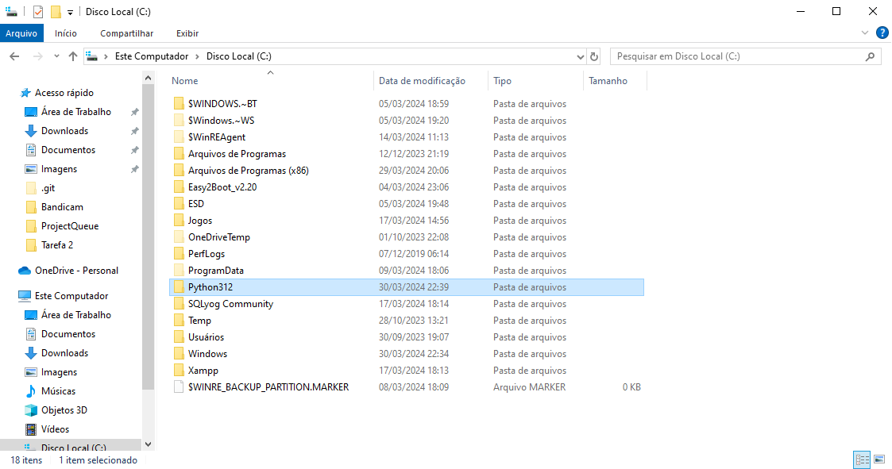
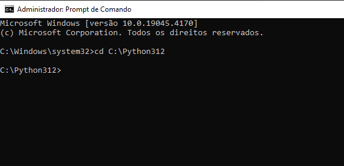
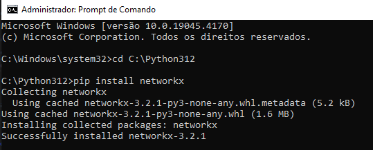
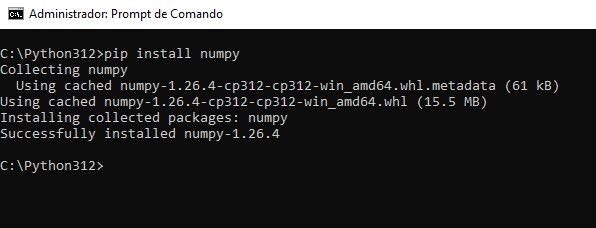
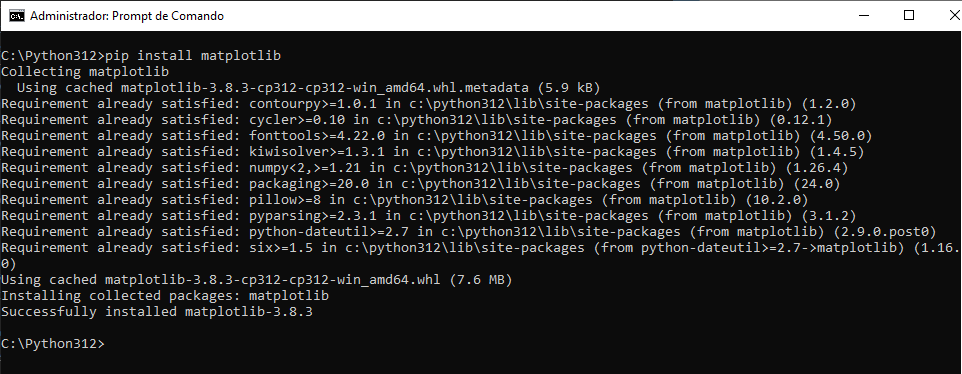

# **Observações**

* Para maior facilidade com as bibliotecas necessárias, utilizar a ferramenta `Google Colab`!

* Caso queira baixar e rodar o projeto em sua máquina, utilize-se do tutorial a seguir para tal.

<details>

<summary>👇 Como instalar as bibliotecas em sua máquina. 👇</summary>
<hr>

* Para fazer o projeto funcionar em sua máquina, é necessário a instalação das seguintes bibliotecas:

```
networkx
numpy
matplotlib
```

⚡ Instalando as bibliotecas na prática ⚡

1. Abra o seu diretório onde está localizado a pasta com os scripts do Python;

2. Copie o diretório e abra no seu terminal, executando como administrador, através do comando `cd`;

3. Execute o comando `pip install networkx` para instalar a biblioteca `networkx`;

4. Execute o comando `pip install numpy` para instalar a biblioteca `numpy`;

5. Execute o comando `pip install matplotlib` para instalar a biblioteca `matplotlib`.

6. Com isso, haverá a estrutura necessária para rodar o projeto.

> <strong>Nota:</strong> Para mais informações, consulte o seguinte vídeo: https://youtu.be/MvUMAvmviaE?si=MRA8Psic26KqksIc

</details>

<br>

# **Sobre o algoritmo de Dijkstra**

O algoritmo de Dijkstra é um algoritmo guloso que encontra o menor caminho de um único vértice de origem para todos os outros vértices em um grafo ponderado. É um dos algoritmos mais importantes da teoria de grafos e tem diversas aplicações em áreas como logística, transporte e redes de computadores.

### **Funcionamento**

1. Comece com o vértice de origem e marque-o como "visitado".
2. Para cada vértice adjacente ao vértice de origem, calcule a distância total do vértice de origem ao vértice adjacente.
3. Escolha o vértice adjacente com a menor distância total e marque-o como "visitado".
4. Repita os passos 2 e 3 até que todos os vértices estejam "visitados".

### **Vantagens**

* Eficiencia: O tempo de execução do algoritmo é O(E log V), onde E é o número de arestas e V é o número de vértices no grafo.
* Simplicidade: O algoritmo é fácil de entender e implementar.
* Versatilidade: O algoritmo pode ser adaptado para resolver diferentes problemas de menor caminho.
  
### **Aplicações**

* Encontrar a rota mais rápida entre duas cidades em um mapa.
* Calcular o menor custo de envio de um pacote entre duas cidades.
* Encontrar o caminho mais eficiente para um robô navegar em um ambiente.


